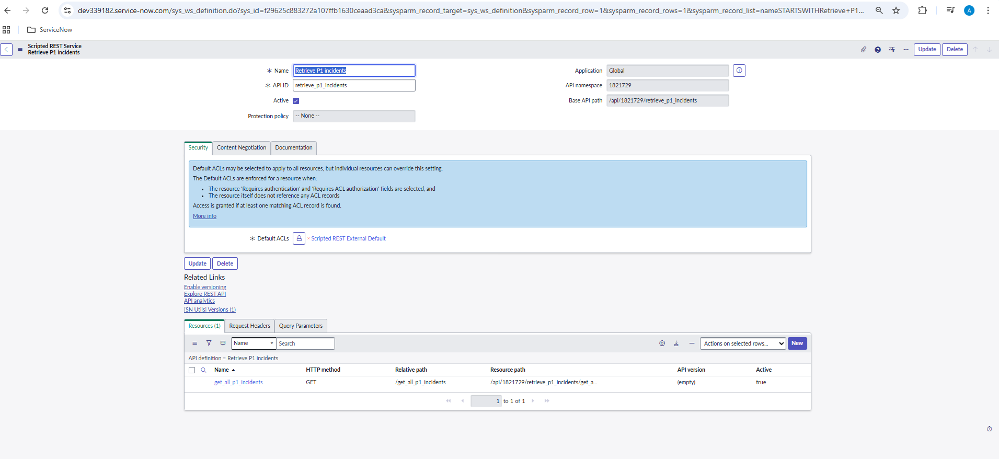

# ITSM Customization & Process Automation

## 📌 Overview

This project showcases **ITSM process automation in ServiceNow** by implementing SLAs, access controls, client scripts, and scripted REST APIs to improve incident management efficiency.  
It demonstrates how core ITSM modules (Incident, Request, and Task) can be customized for real-world service delivery needs.

---

## 🚀 Features

- **SLA Definitions**

  - Configured SLA metrics (e.g., P1 Incident must be resolved within 4 hours).
  - Attached SLAs to Incident and Request modules with pause/resume conditions.

- **Access Control (ACLs)**

  - Restricted updates of high-priority incidents to **Support Group Managers**.
  - Enforced role-based security for Incident & Task records.

- **Catalog Customization**

  - **Catalog Client Script**: Auto-fills “Requested For” with the logged-in user (default but editable).
  - **UI Policy**: Dynamically shows/hides fields based on Category (e.g., Hardware vs. Software).

- **Automation with GlideRecord**

  - Background Script to mass update incident priorities based on urgency/impact.

- **Scripted REST API**
  - Created a REST API resource `/get_all_p1_incidents` to fetch all **open P1 incidents** in JSON format.
  - Example response:
    ```json
    {
    "records": [
            {
                "number": "INC0000015",
                "short_description": "I can't launch my VPN client since the last software update",
                "priority": "1",
                "state": "2",
                "assigned_to": "Don Goodliffe",
                "opened_at": "2025-03-11 23:38:46",
                "sys_id": "46e2fee9a9fe19810049b49dee0daf58"
            }
      ]
    }
    ```

---

## 🖼️ Screenshots

- SLA Definition  
  

- Scripted REST API  
  

- Catalog Script & UI Policy  
  

- Background Script (GlideRecord)  
   

- ACLs for High-Priority Incidents  
  

- More Screenshots can be found in individual folders

---

## 🛠 Tech Stack

- **ServiceNow ITSM** (Orlando release or higher)
- **GlideRecord / Server-side scripting**
- **Catalog Client Scripts & UI Policies**
- **Scripted REST APIs**
- **Update Sets (XML exports)**

---

## 📥 How to Import

1. Download the update set from:  
   `/updateset/sys_remote_update_set_293d610483672a107ffb1630ceaad377.xml`
2. Navigate to **System Update Sets > Retrieved Update Sets** in your ServiceNow instance.
3. Import and Preview before committing.
4. Commit to apply all configurations.
   > ⚠️ Requires **admin role** on your ServiceNow instance.

---

## 📌 Deliverable

A working ITSM customization showcasing **automation, access control, and API integrations** in ServiceNow.  
This project demonstrates how a developer can enhance ITSM processes to align with organizational requirements.

---
